目录

[toc]

---

# 遮罩
`原理: 两张图片和一个颜色相乘, 遮罩图为 黑白 (0,1) 所以主纹理只会保留遮罩图不为0的地方,就只显示遮罩纹理的区域了.叠加颜色是为了改变颜色`

1. 材质与设置:
    1. Unlit模板
    2. 混合模式 Blend RGB 为 Additive 叠加模式
    3. 关掉ZWrite Mode 深度写入模式
    4.Tags - RenderType - Type 设置为 Transpartnt 透明 . 点+ 新增Queue - Transparent
2. 新建两个纹理(T) 节点, 一个主纹理, 一个遮罩纹理
3. 新建UV(U) 节点.
4. 新建Panner节点(uv流动节点), UV节点 与一个 float2节点连接到uv 与 Speed. 最后它out到主纹理UV
5. 重复3,4, out到遮罩纹理UV
6. 两纹理相乘与一个color 相乘 Multiply(M)
7. 最后连接到 Frag Color

# 硬边溶解
`原理: 一张黑白图的单一通道 R 与一个 float1(范围 0-1.05, 因为float1做运算a时需要完全大于1才能让图的alpha为0) 进行Step 运算 (a > b = 0 , a <= b = 1). 让它变成溶解图. 最后让溶解图跟原图的A通道相乘 (保留原图的透明区域), 再与原图去掉(component mask) a通道的结果相加(Append)即可.`

材质与设置:
   1. Unlit模板
   2. 混合模式 Blend RGB 为 Alpha Blend 透明混合
   3. 关掉ZWrite Mode 深度写入模式
   4. Tags - RenderType - Type 设置为 Transpartnt 透明 . 点+ 新增Queue - Transparent
 

# 光边溶解
`原理: 在硬边溶解的情况上.叠加一个比原来溶解图大一圈的溶解图进行相减即可得到光边范围. 然后使用lerp让原图的颜色信息与光边颜色信息融合. 再使用最大的溶解范围做Alpha通道就得出最后的结果`

材质与设置:
    1. Unlit模板
    2. 混合模式 Blend RGB 为 Alpha Blend 
    3. 关掉ZWrite Mode 深度写入模式
    4. Tags - RenderType - Type 设置为 Transpartnt 透明 . 点+ 新增Queue - Transparent

# UV扰动
`原理: 使用Lerp 让图片的UV在自身和流动的噪点UV中过度`

材质与设置:
    1. Unlit模板
    2. 混合模式 Blend RGB 为 Alpha blend 
    3. 关掉ZWrite Mode 深度写入模式
    4. Tags - RenderType - Type 设置为 Transpartnt 透明 . 点+ 新增Queue - Transparent

# 边缘光
`原理: 菲尼尔 与 纹理图或者颜色相乘`

1. 材质与设置:
    1. Unlit模板
    2. 混合模式 Blend RGB 为 Additive 叠加模式
    3. 关掉ZWrite Mode 深度写入模式
    4.Tags - RenderType - Type 设置为 Transpartnt 透明 . 点+ 新增Queue - Transparent
    

2. 关于菲尼尔算法 (使用这个可以闪点)
    

# 扰动火焰
`原理: 使用2个噪点图加一个扰动图相乘, 再与主纹理UV 相加 即可`

材质与设置:
    1. Unlit模板
    2. 混合模式 Blend RGB 为 Additive 叠加模式
    3. 关掉ZWrite Mode 深度写入模式
    4. Tags - RenderType - Type 设置为 Transpartnt 透明 . 点+ 新增Queue - Transparent

# 切换URP

# 深度渐变
`原理:使用深度渐变节点(相交处为0 越远越大) 取反, 使用Saturate 锁定在 0 - 1, 材质给球,即可形成扫描扩大效果. 也可以乘于一个纹理. 但是纹理会基于模型uv ,所以可以转换为屏幕uv `

# 软粒子|顶点颜色
><b>关于深度写入</b>:如果打开了. 纹理则有前后关系

><b>关于顶点颜色</b>: 发射的粒子颜色计算使用的是顶点颜色的计算方式.所以如果要在面板调节颜色.需要乘上顶点颜色

><b>小技巧</b>: 因为粒子的顶点颜色可以设定根据时间 0 - 1 / 1 - 0 . 所以使用他的A通道来实现Step等节点的生命周期内溶解等效果动画

`原理: 粒子与物体相接的地方会比较生硬的切边. 如果让它的A通道与深度渐变进行混合即可实现软粒子`

材质与设置:
    1. Unlit模板
    2. 混合模式 Blend RGB 为 alpha blend 叠加模式
    3. 关掉ZWrite Mode 深度写入模式
    4. Tags - RenderType - Type 设置为 Transpartnt 透明 . 点+ 新增Queue - Transparent

# 粒子CustomData|顶点数据流
`原理:粒子的顶点数据与shader的顶点数据对应起来. 一般第一个顶点数据给主纹理使用. 我们就可以用第二个顶点数据来做自定义数据了.`

1. 连连看图

2. shader代码解析

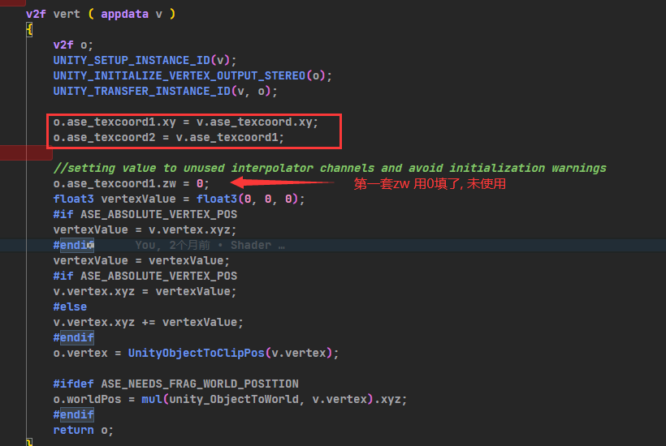

3. 粒子设置
在Renderer - Custom Vertex Streams 开启: 如果没有使用顶点颜色, 则删掉顶点颜色.
使用UV2 来填满shader的第一套UV并未使用的zw (开始zw = 0的地方.)
然后添加一个自定义数据Custom1.xyzw, 即可对应了shader 里的第二套UV

这时候即可给Custom栏里的数据进行K曲线动画 x,y uv流动 z 扰动差值 w溶解值
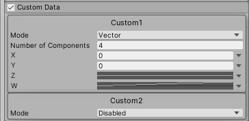

# 软溶解
`原理: 原来的溶解是step 溶解. 即非0 即1, 软溶解需要 保留原来的渐变, 所以就让原来的溶解图 加上 -1 -  1的值(需要Saturate防止超过 0 ,1), 来实现 0 到1 的过渡
当控制值为1时,溶解图全白.即原图不溶解. 控制值为-1时. 原图完全溶解.`

材质与设置:
1. Unlit模板
2. 混合模式 Blend RGB 为 alpha blend 
3. 关掉ZWrite Mode 深度写入模式
4. Tags - RenderType - Type 设置为 Transpartnt 透明 . 点+ 新增Queue - Transparent
 下图是课程采用了溶解值 + 1 后 再 + ( - 2 - 0 )  麻Q烦 

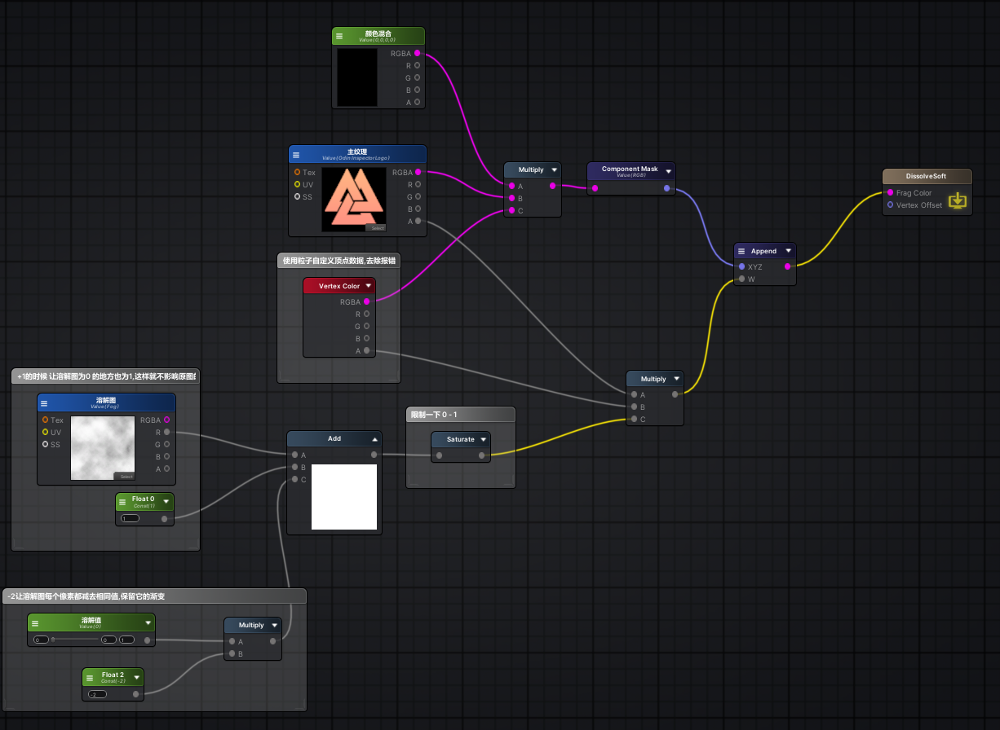

# Remap采样(护盾)
`原理: 渐变图的uv采样决定他的rgb样色. 当菲涅尔与深度渐变结合时再与渐变图uv相结合, 就可以形成一个渐变的护盾.`

1. 材质与设置:
    1. Unlit模板
    2. 混合模式 Blend RGB 为 additive 
    3. 关掉ZWrite Mode 深度写入模式
    4. Tags - RenderType - Type 设置为 Transpartnt 透明 . 点+ 新增Queue - Transparent
2. 先处理菲涅尔 屏幕方向与世界法线的点乘(渐变球) , 绝对值(防闪) , 1减(外亮内暗), 最后power控制边缘宽度

3. 然后深度渐变与菲尼尔想加 (取反:相交处亮 , 远处暗) saturate (防止远距离过曝)

4. 纹理图 结果与前面的相乘. 因为他们不是叠加关系 所以不能加, 只能在球形范围内显示纹理

5. 最后是remap采样的渐变颜色

渐变图样式:

最终效果

# 控边溶解
效果图 跟软溶解不一样的地方是, 在溶解之前,会先出现溶解图纹理,然后再溶解.(先被溶解图侵蚀再溶解)

`原理:软溶解的基础上使用lerp 让渐变的地方显示溶解图 然后再溶解.  最后append一起即可`

1. 材质与设置:
    1. Unlit模板
    2. 混合模式 Blend RGB 为 alpha blend 
    3. 关掉ZWrite Mode 深度写入模式
    4. Tags - RenderType - Type 设置为 Transpartnt 透明 . 点+ 新增Queue - Transparent
2. 第一部先软溶解

3. 然后给渐变图做UV
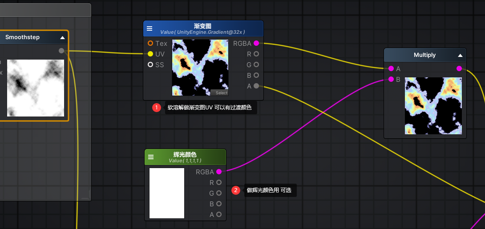
4. 最后就是溶解图rgb与原图rgb做lerp融合 alpha 采用溶解图的A通道, 再把lerp后的图去除a通道. 和Smoothstep溶解图的乘于原图的A通道结合即可.

# 扭曲
`原理:取得屏幕UV,与一个UV流动的扰动图做Lerp融合后 赋值给 屏幕颜色 Grab Screen Color即可扭曲. 其中还可以继续添加遮罩mask(Grab Screen Color 取 mask 的 A通道)`

1. 材质与设置:
    1. Unlit模板
    2. 混合模式 Blend RGB 为 alpha blend 
    3. 关掉ZWrite Mode 深度写入模式
    4. Tags - RenderType - Type 设置为 Transpartnt 透明 . 点+ 新增Queue - Transparent + 2  (此处+2 可能是为了让透明以下的都扭曲, 待验证)
2. 扭曲部分

3. 遮罩部分

# 正反面(面具)
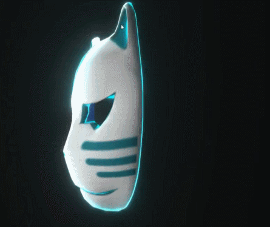

==关键节点 : Switch by Face==

`原理: 使用正反节点. 让正面显示纹理加菲涅尔. 背面显示一张流动星空图叠加一个经过扰动的流动图`

1. 材质与设置:
    

    1. Unlit模板
    2. 混合模式 Blend RGB 为 alpha blend 
    3. 关掉剔除模式 Cull Mode : off
    4. Tags - RenderType - Type 设置为 Transpartnt 透明 . 点+ 新增Queue - Transparent

2. 正面的菲尼尔纹理 
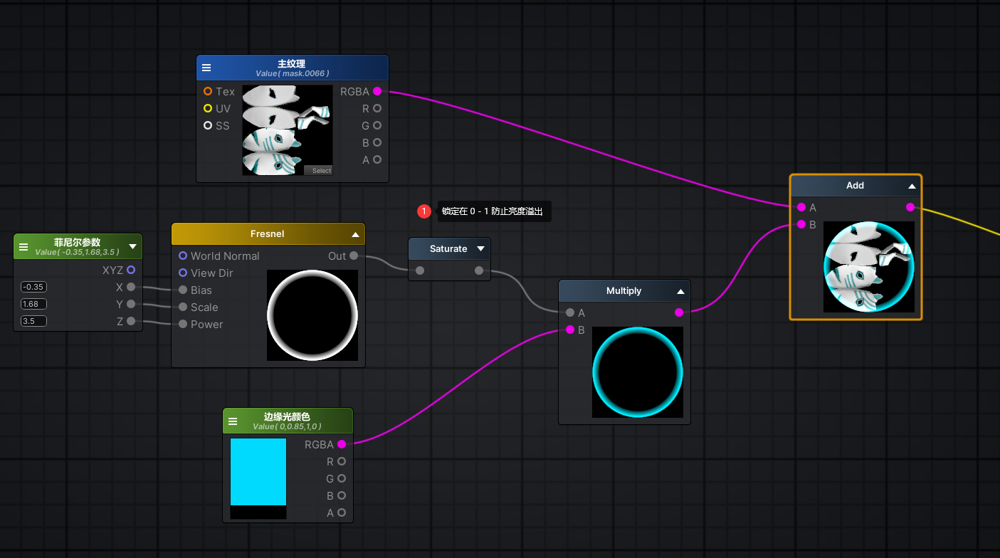

3. 背面的流动的星空纹理 (保持屏幕坐标的方向)
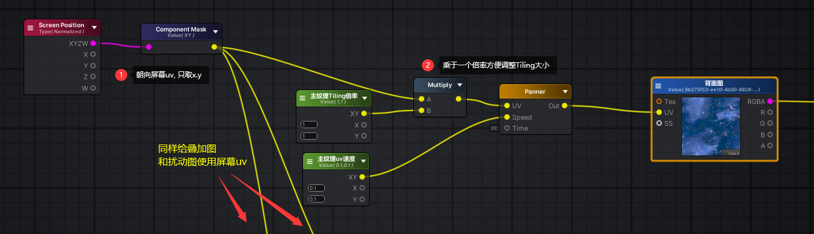

4. 背面扰动UV的叠加图
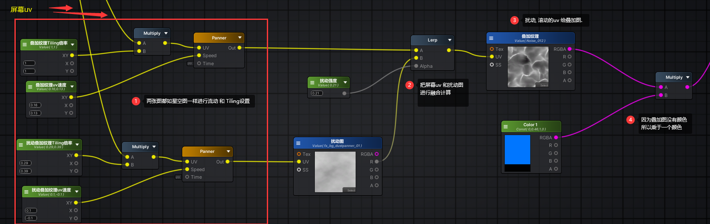

5. 最后星空和叠加图进行颜色叠加输入到背面即可
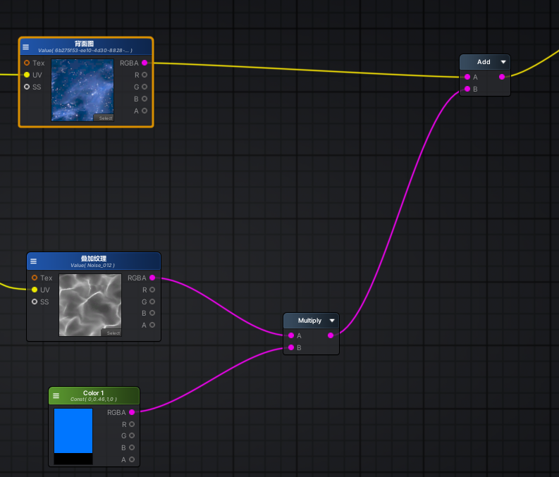

# 色相

==关键节点: RGB to HSV  \ HSV to RGB==
1. 材质与设置:
   

    1. Unlit 模板
    2. 深度写入 ZWriteMode 关掉
    3. 混合Blend RGB : alpha blend (如果需要发光,比如光剑 就选 Add)
    4. Tags - RenderType - Type : Transparent . + 新增 Queue : Transparent

简单. 看图就行
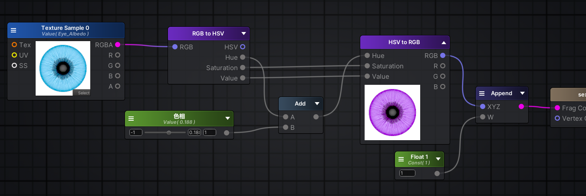

# 公开材质模板属性

只需要新建一个<b>float</b> 然后 在<b>Attributes</b> 选中对应的属性 设置 然后就可以到<b>Output Node</b>里链接到右边有小点点的属性里了. 
注意需要勾上 <b>Auto-Register</b> 同时变量要是公开的 <b>Property</b>

# UI 流光

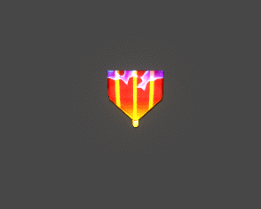

==关键节点:(Template parameter) sprite texture : 获取Image 或者 sprite 的图片信息==

`原理: 使用原图 与一个流动图add , 流动图的uv 可以经过扰动处理. 然后 流动图的alpha和原图alpha相乘,避免原图透明的地方有流动图. 然后alpha需要要锁定到0-1 避免和别的图叠加问题.`

<b>
注意流光图需要把Default Texture选项选为Black, 在它为空的时候就全是0 避免影响原图.
</b>
下面实例忘记最后乘于顶点颜色了. 需要注意补上. 否则图片就不受颜色选项的影响了.

1. 材质与设置:
   1. Default UI模板
   2. 其他默认就行
2. 设置流光图,将流光图的uv与扰动图进行插值后赋予流光图 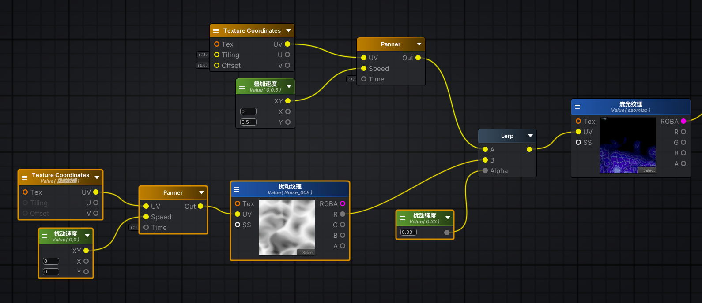
3. 最后将处理后的流光图与原图就行叠加即可

# 自定义表达式

==关键节点: Custom Expression==

跟着上一个UI 流光进行改造. 上一个ui流光效果只会一直循环闪光, 没有办法设置间隔时间. 如果需要间隔时间,则需要使用自定义的表达式.

改造点:
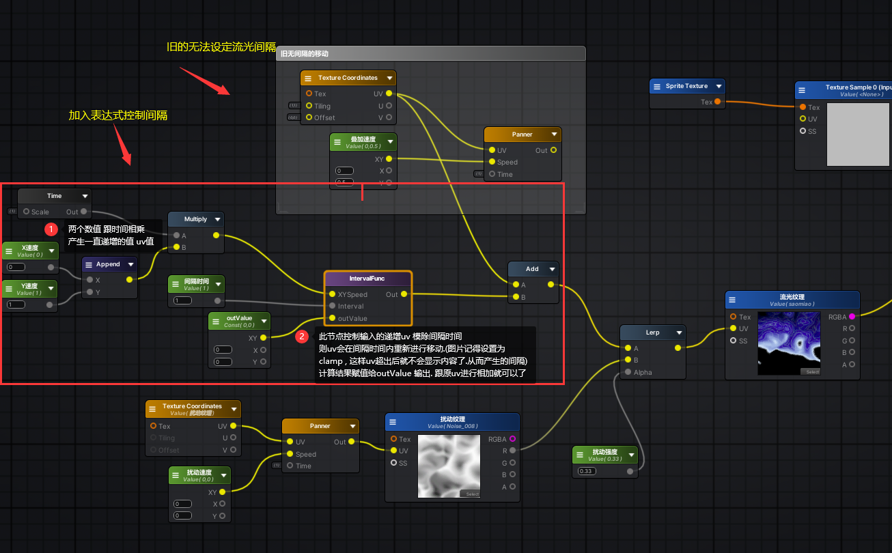

表达式节点:
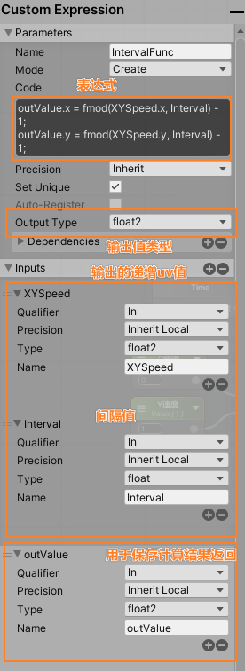

# FlowMap

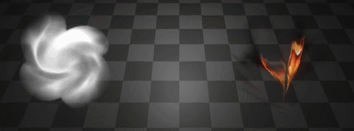

`原理:FlowMap 就是一个用液化工具涂抹过后的uv图. 让原图根据此UV图进行扭曲. 配合溶解图进行扭曲消散的效果`

1. 材质与设置:
   

   1. Unlit模板
   2. ZWrite Mode 关掉
   3. 混合模式 Blend RGB : Alpha Blend
   4. RenderType: Transparent | + 新增 Queue Transparent

2. 设置FLowMap扭曲:
   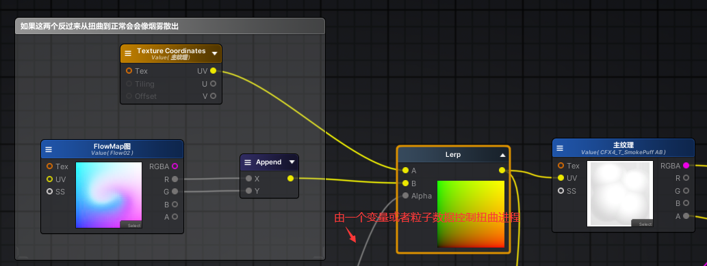
3. 设置软溶解图. 同时用一个开关选中控制进程的方式
   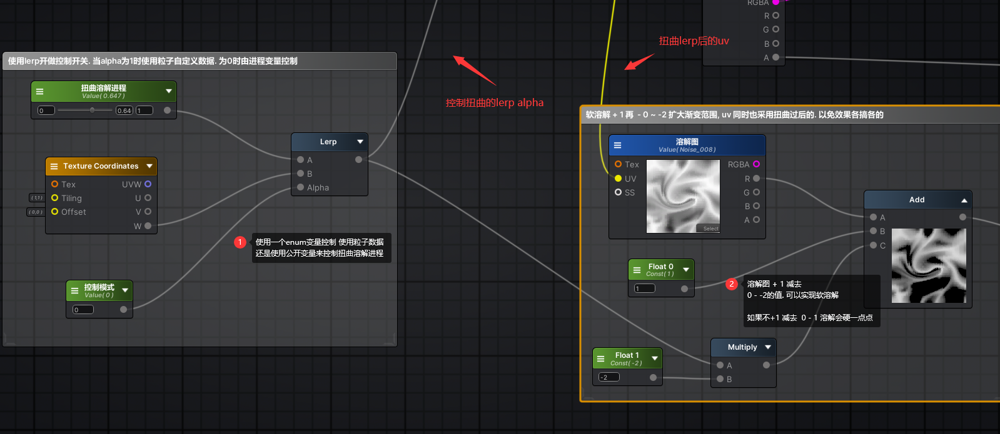
4. 设置软溶解图的软硬程度
   
5. 当运行的时候发现图片边缘有白边. 可以设置一个圆形遮罩.过滤掉边缘的白边
   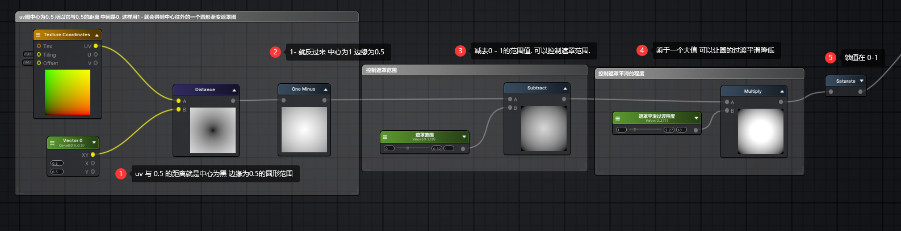
6. 最后把原图的a值 遮罩和溶解图 相乘后跟原图合并 即可
   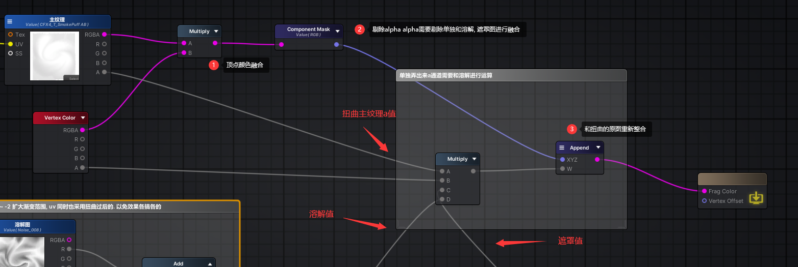

## 关于FlowMap的制作
1. 打开ps创建一个512 x 512的空白图.
2. 切换到图层里面的通道. 使用渐变颜色填充**r**通道左黑右白 代表**u**方向数值. 使用下黑上白填充**g**通道. 代表**v**方向.
   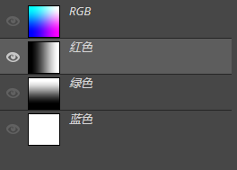
3. 然后回到图层, 使用滤镜里面的液化对图按需求涂抹导出就可以了.

# 子函数与重映射

1. Amplify Shader Function 作为子函数shader
2. 主要通过input的节点接受外部传入数据. 处理以后 output 出去. 类型函数封装
   参考以下的软溶解图即可:
   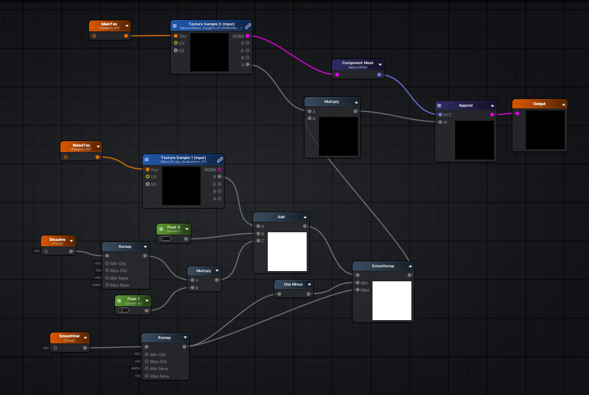

# 信号干扰,通道偏移
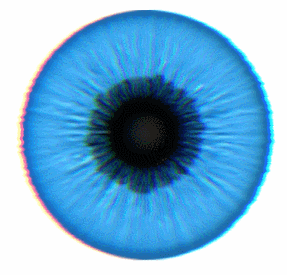

`原理 : 原图进行扰动后uv 进行rgb三个颜色的左中右的分离`
1. 材质与设置:
   

   1. Unlit模板
   2. ZWrite Mode 关掉
   3. 混合模式 Blend RGB : Alpha Blend
   4. RenderType: Transparent | + 新增 Queue Transparent

1. 原图的uv扰动处理. 需要处理一下扰动强度. 防止原图变形太大.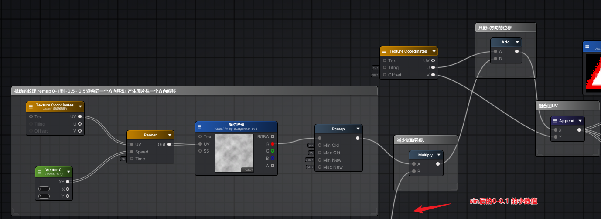
2. 制作左右偏移的uv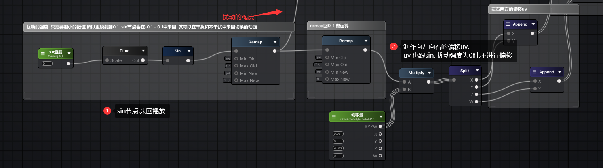
3. 组合处理过后的3张图片的rgb通道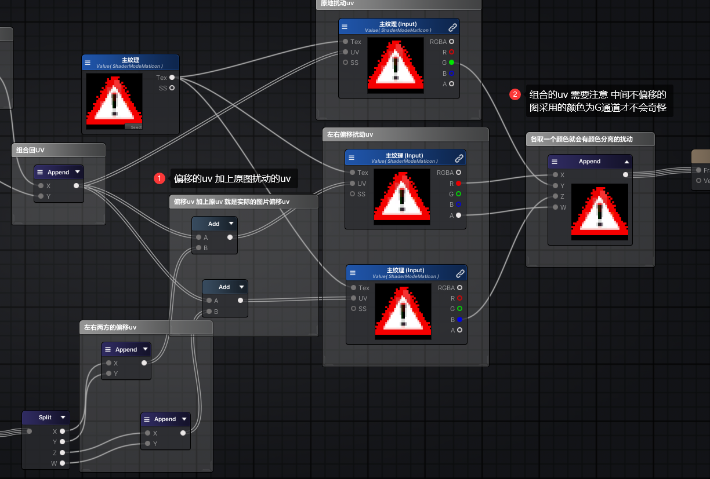
4. 全图: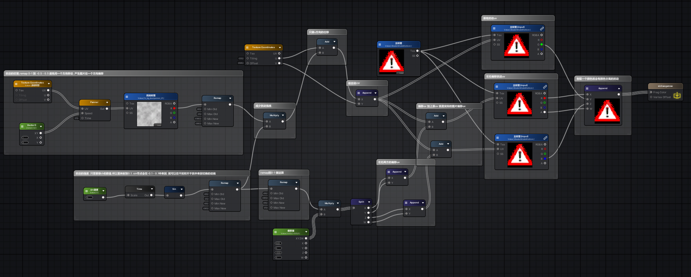

